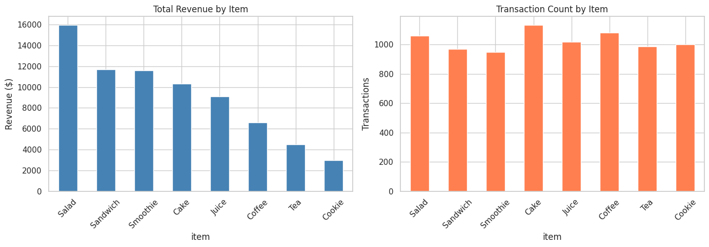
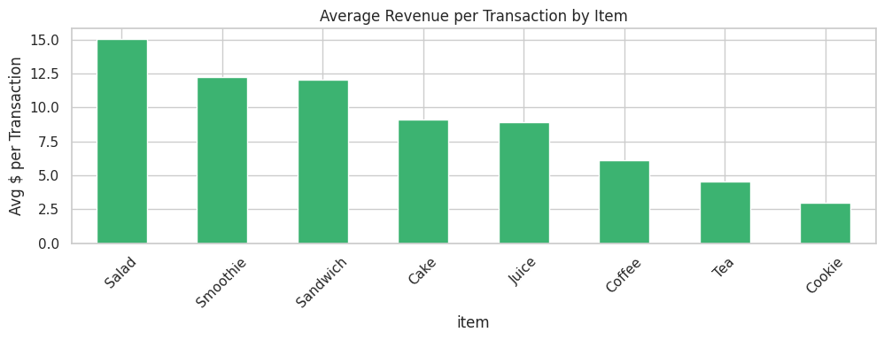
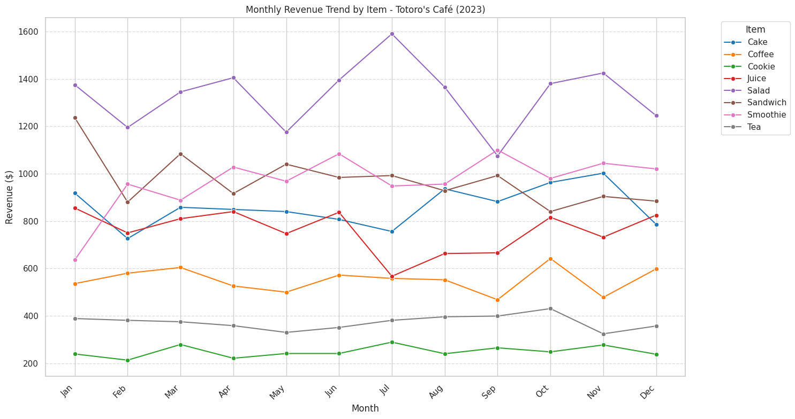
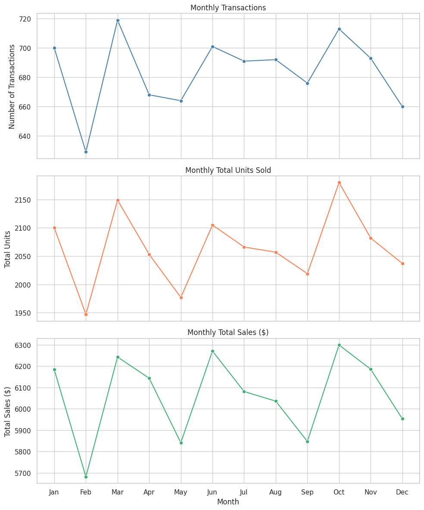
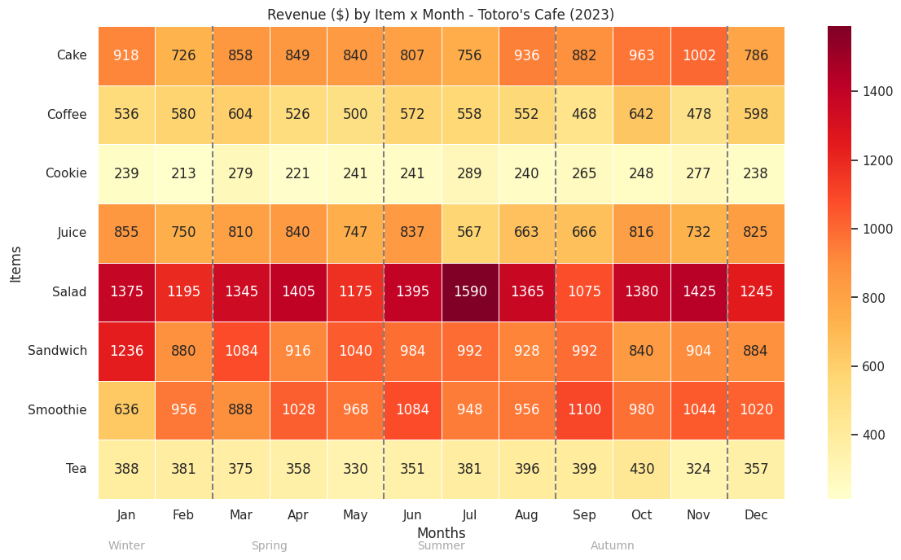
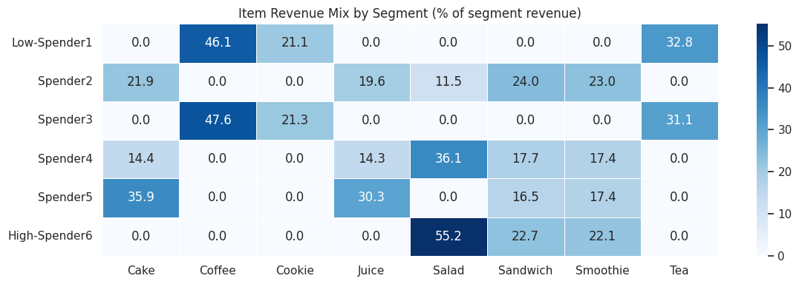
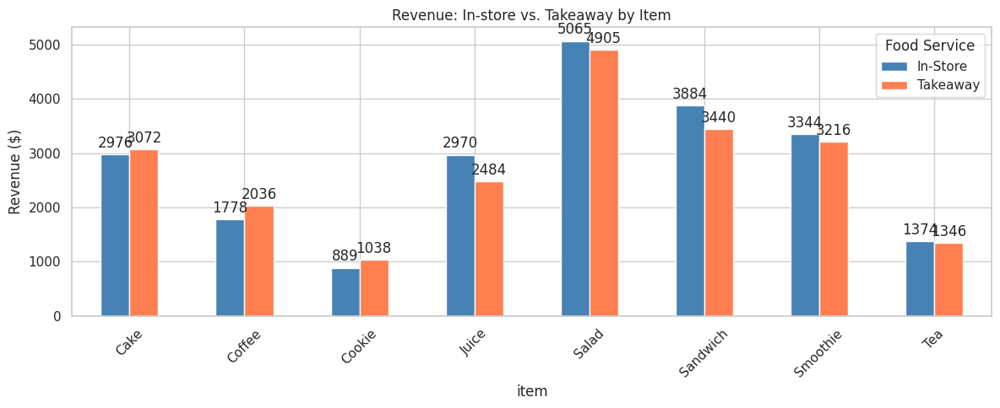
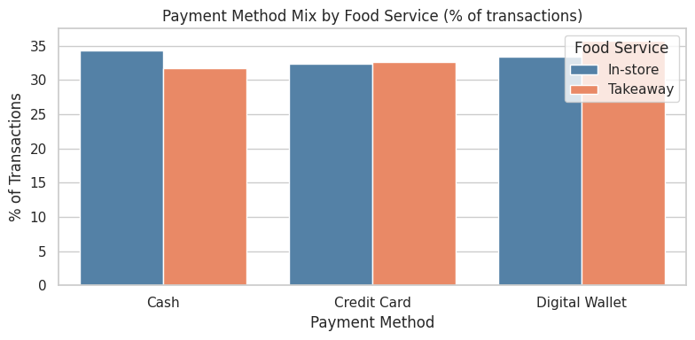
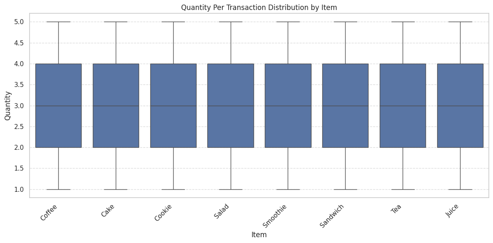

# Totoro's Cafe Sales Analysis (Ad Hoc)

## Executive Summary

**The coffee isn't carrying the business**

Totoro's Café generates its **highest revenue from Salad and Sandwich — not Coffee.**  

* Salad alone brought in **$15,970**, nearly **2.4x more than Coffee's $6,614**, despite Coffee having more transactions (1,083 vs. 1,061).
* Sandwich also outsold Coffee in dollars while having fewer total orders.

**Why this matters:**  
A café's identity and marketing typically center on coffee — but the data shows food items are actually the revenue engine. 

This is a strategic signal to rethink menu placement, pricing, and promotional focus: *food (Salad, Sandwich, Smoothie) deserves equal or greater attention than the beverage line.*







## Business Context

The business goal of the owner is to maximize revenue from Totoro's Café's current operations by aligning menu focus, promotional timing, and customer retention efforts with what the data shows actually drives sales — not assumptions.
 
Because if the owner doesn't know which items or customers actually drive revenue, opening a second location just replicates the same blind spots at higher cost and risk. 

Optimization is the diligence step that has to happen before expansion is a safe conversation or next step.

## Objective

**Revenue & Basket Value:**

> * Which items drive the most total revenue?  
> * What is the average basket size (qty × price) per transaction? 

**Product Mix & Popularity:**

> * What are the best-selling items by volume vs. by revenue? (do they differ?) 
> * Are certain items purchased in higher quantities per transaction (bulk-buying behavior)? 

**Time & Seasonality:**

> * Which months or days generate the most transactions and revenue? 
> * Are there seasonal peaks for specific items (e.g., Smoothies in summer, Tea in winter)? 

**Channel & Food Service:**

> * Do In-store vs. Takeaway customers have different spending patterns? 
> * Does payment method vary by Food Service? (e.g., Takeaway customers prefer Digital Wallet)  
> * What is the Food Serving revenue by Item? 

**Customer Segments (Behavioral):**

> * Can we group transactions into meaningful spending tiers (low / mid / high spenders)? 
> * What does the "typical" transaction look like for each segment? 
> * Which segment contributes the most revenue? 
> * What specific items do each Spender favor? 

## Data
* Source: [Kaggle Cafe Sales Dirty](https://www.kaggle.com/datasets/ahmedmohamed2003/cafe-sales-dirty-data-for-cleaning-training)
* Size: 10,000 records.
* Time period: year 2023.
* Any limitations/caveats: synthetic sales transactions records with intentionally missing values, inconsistent data, and errors.

## Approach
Brief narrative of methodology — cleaning, exploration, modeling/testing.
(Save deep technical detail for the notebook/code itself.)
1. Perform Exploratory Data Analysis
2. Data Cleaning and Transformation
3. Apply Descriptive Analysis
4. Apply Diagnostic Analysis
5. Apply Predictive Analysis
6. Write up findings and conclusions
7. Recommendations for the stakeholder (coffee owner)

## Other Key Findings

1. **The February slump is a product problem, not a traffic problem.**   
Transaction counts and basket sizes in February were nearly identical to the yearly average — the drop in revenue was driven almost entirely by weak Sandwich, Salad, and Cake sales that month.  
**Action:** target February promotions at these three items specifically, rather than running store-wide discounts.

   
   

2. **Every revenue peak (March, June, October) is driven by a different set of items** — no single item or promotion explains all three.  
**Action:** A one-size-fits-all seasonal campaign will underperform; promotions should be tailored per season.

   

3. **Smoothie is a quiet high-performer.**  
It ranks lower in total transactions but delivers strong revenue efficiency and is a key driver of the October peak — a good candidate for upsell or bundling.

   

4. **Two customer segments drive nearly half of all revenue.**  
The top two spending tiers (out of six identified) account for **~49% of total revenue**, favoring Salad, Sandwich, and Smoothie.  
**Action:** Loyalty or upsell programs aimed at these segments would have outsized impact.

   

5. **In-store and Takeaway perform almost identically overall**  
(In-store edges out by ~1%), but Salad over-indexes for In-store customers — useful for tailoring in-store merchandising vs. takeaway packaging/menu emphasis.

   

6. **Payment preferences shift slightly by channel:**  
Takeaway customers lean toward Digital Wallets (35.7% vs. 33.4% In-store), while In-store customers favor Cash (34.3% vs. 31.7%). Minor, but relevant for checkout/POS optimization.

   

7. **No bulk-buying behavior detected.**  
Quantity per transaction is consistent (median of 3 units) across every item. Customers aren't stocking up on any particular product, so bulk-pack promotions are unlikely to move the needle.

   

8. **Data quality gap worth flagging to operations:** ~20% of records are missing Food Service or Payment Method, and ~40% of Food Service records are logged as "Unknown."  
This limits the precision of channel-based insights and should be addressed at the point-of-sale system level.

---

*Analysis based on 8,206 cleaned transaction records from Totoro's Café, 2023.*

## Business Impact / Recommendation

My recommendations for maximizing revenue and reliability within Totoro's Café's **current operations.**

### First — Foundational

1. **Fix data capture at the POS.**  
   *Blocks reliable decision-making; everything below depends on this being solid.*  

     * ~20% of records are missing Location/Payment Method
     * and, ~40% of Food Service records are logged as "Unknown."

### High-Impact, Low-Cost — Immediate Action

2. **Rebalance menu focus toward food, not just coffee.**
   * Salad and Sandwich outearn Coffee despite comparable or fewer transactions. 
   * Shift menu boards, staff upsell scripts, and promotional spend to what actually drives revenue.

3. **Run a targeted February campaign on Sandwich, Salad, and Cake specifically.**
   * The slump is item-specific, not a traffic problem.
   * A store-wide discount would waste margin on items already performing fine.

4. **Build a retention or loyalty offer for the top two customer segments.**
   * These two tiers drive ~49% of total revenue.

### Medium-Impact — Test

5. **Promote Smoothie as an upsell/bundle item.**
   * It earns a premium per transaction but is ordered less often.
   * The opportunity here is get more orders, not a higher price.

6. **Tailor channel-specific merchandising.**
   * Feature Salad prominently In-store. 
   * Lean on Sandwich and Smoothie for Takeaway, where they hold up relatively better.

### Monitor

7. **Payment method mix by channel** 
   * (Digital Wallet vs. Cash) shows only a modest split. 
   * Worth re-checking once data quality (Recommendation #1) is fixed and the picture is clearer.

8. **Bulk-buying promotions are not worth pursuing.**
   * Quantity per transaction is consistent across all items — there's no bulk-purchase behavior to incentivize.


## Tools & Techniques
This analysis utilized a variety of Python libraries, data manipulation techniques, visualization methods, and analytical approaches:

**Python Libraries:**
*   `pandas`: For data loading, manipulation, and analysis.
*   `numpy`: For numerical operations.
*   `matplotlib.pyplot`: For creating static, interactive, and animated visualizations.
*   `seaborn`: For high-level statistical data visualization.
*   `fg-data-profiling` (`data_profiling.ProfileReport`): For automated data profiling and exploratory data analysis reports.
*   `sklearn.preprocessing.StandardScaler`: For standardizing features for machine learning models.
*   `sklearn.cluster.KMeans`: For performing K-Means clustering.
*   `sklearn.metrics.silhouette_score`: For evaluating the quality of clusters.
*   `google.colab.files`: For uploading and downloading files in Google Colab.

**Data Handling and Preprocessing Techniques:**
*   **Data Loading:** Reading data from CSV (`pd.read_csv`).
*   **Column Standardization:** Lowercasing and replacing spaces in column names.
*   **Data Type Casting:** Converting columns to numeric and datetime types (`pd.to_numeric`, `pd.to_datetime`).
*   **Missing Value Handling:**
    *   Filling `NaN` values in categorical columns with "Unknown" (`.fillna()`).
    *   Dropping rows with `NaN` values in critical numerical columns (`.dropna()`).
    *   Unifying inconsistent representations of 

**AI Models:**
* **Claude AI:** 
    * Documentation framework
    * Analysis check
    * Compressing documentation
    * Polish stakeholder recommendations
* **Google Gemini**:
    * Coding review
    * Overcome visualization blockers

## Repo Structure
```
├── data/
├── images/
├── notebooks/
└── README.md
```